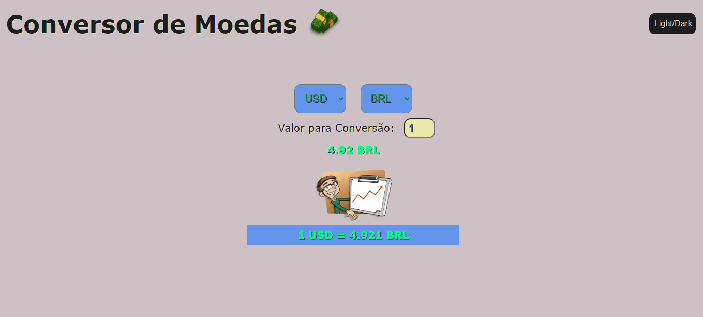
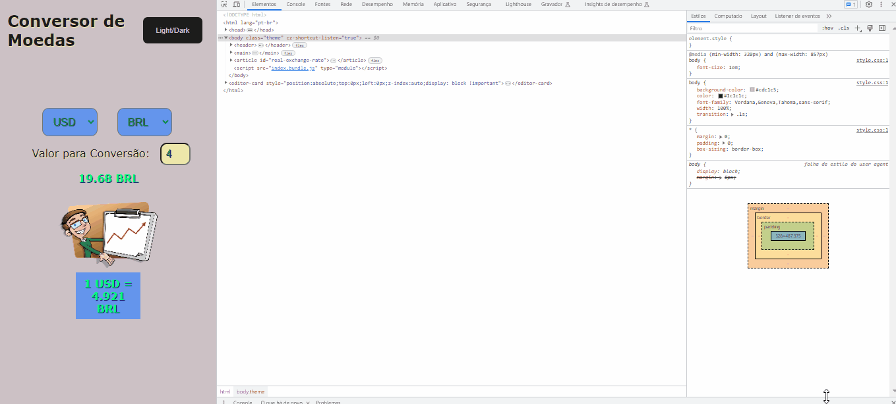

# currency converter using Fetch Requests

___________

## install and run

Running this converter shouldn't be too complicated for you.

## global dependencies
## 1 Install Node.js and yarn or npm:
Look for it on official websites and install it on your computer. To check if it is already installed on your system open the terminal and run:

``node -v`` <br>
 or <br>
``npm -v`` <br>
or <br>
``yarn -v``

______

### Remember to create a structure for your application:
example:
<pre>
project
└── src
    └── example.js
</pre><br>

In this project inside the src page I placed the js folder with the necessary functions for the code and the sass folder that contained the style.scss file and using the command sass --watch sass/style.css:styles/style.css I created css file being processed by sass...Or compile using webpack after installing and running your loaders and plugins.
[sass documentation](https://sass-lang.com/documentation/)

## 2 Start the application:
return a folder to your project home folder using the cd command.. or if you prefer install the package in the src folder.
``yarn init -y``<br>
``npm init -y``<br><br>
The command will create a package.json with the necessary information to execute new dependencies:
<pre>
project
├── src
│   └── example.js
└── package.json
</pre>
The package.json will be responsible for listing and verifying the versioning, as well as the packages dependent on the application.

## 3 install and run webpack
* Command to install webpack:
npm install -D webpack webpack-cli
* Install the loaders css-loader,if you decide to include the css in the javascript the style-loader, sass-loader and babel-loader
* Also install the dev server to have a development dependency or use the darling live server
____
### Commands:
- babel-loader: ``npm install -D babel-loader @babel/core @babel/preset-env webpack``<br>
[documentation babel-loader](https://www.npmjs.com/package/babel-loader)
- sass-loader: ``npm install sass-loader sass webpack --save-dev``<br>
[documentation sass-loader](https://www.npmjs.com/package/sass-loader)
- css-loader: ``npm i -D css-loader``<br>
[documentation css-loader](https://www.npmjs.com/package/css-loader)
- style-loader: ``npm i -D style-loader`` It is recommended to combine with css-loader<br>
[documentation style-loader](https://www.npmjs.com/package/style-loader)
- webpack-dev-server: ``npm install webpack-dev-server --save-dev``<br>
[documentation dev-server](https://www.npmjs.com/package/webpack-dev-server)
______

### configure the webpack
* Create a file in your project's home folder named webpack.config.js
* Create a file in your project's home folder with the name babel.config.js for the loader to find the path to the babel configuration in your project

  ### my webpack file configuration
```
const MiniCssExtractPlugin = require('mini-css-extract-plugin')
const path = require('path')

module.exports = {
  entry: {
    index: './src/js/home.js'
  },
  mode: 'production',
  module: {
    rules: [
        {
      test: /\.s[ac]ss$/i,
      use: [MiniCssExtractPlugin.loader, 'css-loader',{
        loader: "sass-loader",
        options: {
          sourceMap: true,
          sassOptions: {
            outputStyle: "compressed",
          },
        },
      }]
    }, {
      test: /\.js$/,
      use: ['babel-loader']
    }]
  },
  plugins: [new MiniCssExtractPlugin({
    filename: 'style.css'
  })],
  output: {
    filename: '[name].bundle.js',
    path: path.resolve(__dirname, './public')
  }
}
```
### my babel file configuration
```
module.exports = {
  presets:[
    ["@babel/preset-env"]
  ]
}
```
### scripts to run the project
modify the scripts part in the package.json file and insert the code below
```
"scripts": {
    "build": "webpack",
    "dev": "webpack serve"
  }
```
### Configuring the .env file

1. Rename the `.env.example` file to `.env`.
2. Fill in the environment variables in the `.env` file with the correct information.
3. Make sure not to share your sensitive information on the GitHub repository.

## 4 Run project
### To run the project locally, just run the command below:
To run only the build:
```
npm run build
```
To run as a development dependency:
```
npm run dev
```
### Comments:
- To kill all the services, just use the `CTRL+C` keys, which is the terminal standard for killing processes.
- You can check the address of other services inside the `.env` file found in the root of the project, like for example the address and credentials of the local Database or the Frontend of the Email Service.

## Technologies:
* HTML5
* SASS
* JAVASCRIPT
* WEBPACK
* BABEL
* API FETCH
## Used API website:
[Exchangerate-api](https://www.exchangerate-api.com/)<br>

## Images Project



_______

